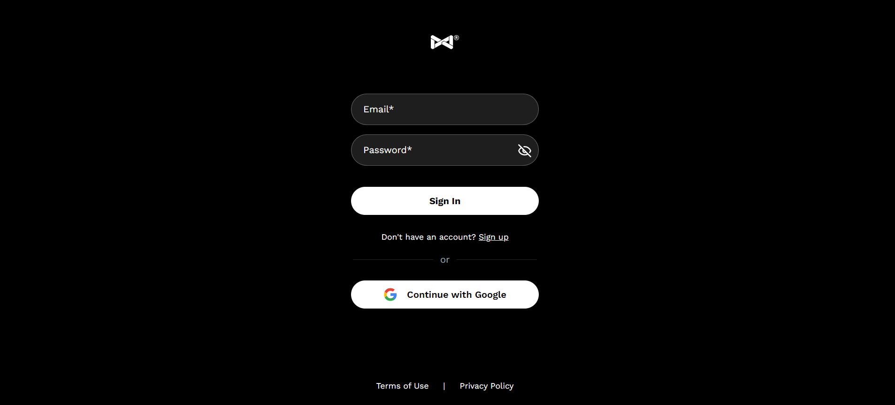
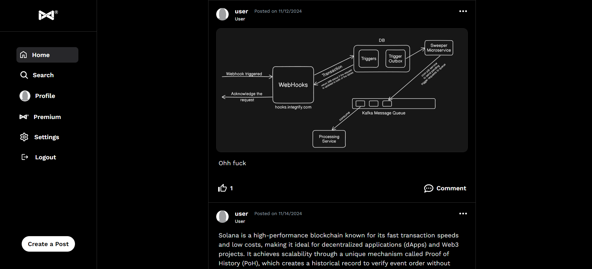
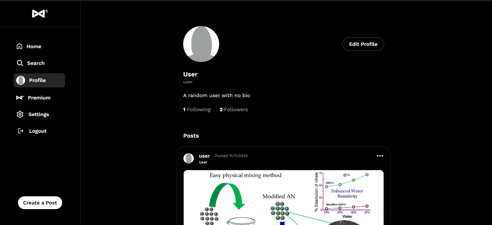

# 📱 [Softcore]

Welcome to Softcore – a modern, responsive, and engaging social media platform designed to bring people closer together. Whether you're sharing moments, discovering content, or connecting with like-minded individuals, our app has you covered.

## 📚 Table of Contents

- [Technologies Used](#-technologies-used)
- [Screenshots](#-screenshots)
- [Contact](#-contact)
- [License](#-license)

## 🚀 Technologies Used

- **Frontend**: [React](https://reactjs.org/) + [Tailwind CSS](https://tailwindcss.com/)
- **Backend**: [Node.js](https://nodejs.org/), [Express](https://expressjs.com/)
- **Database**: [MongoDB](https://www.mongodb.com/)
- **Authentication**: Custom authentication using [JWT](https://jwt.io/)

## 🎨 Screenshots

### Login Page

### Home Page

### Profile Page

## 🌐 Live Demo

Check out the live version of the app [here](https://softcoreapp.vercel.app/).

# 📱 [Softcore]

Welcome to Softcore – a modern, responsive, and engaging social media platform designed to bring people closer together. Whether you're sharing moments, discovering content, or connecting with like-minded individuals, our app has you covered.

## 📚 Table of Contents

- [Technologies Used](#-technologies-used)
- [Screenshots](#-screenshots)
- [Contact](#-contact)
- [License](#-license)

## 🚀 Technologies Used

- **Frontend**: [React](https://reactjs.org/) + [Tailwind CSS](https://tailwindcss.com/)
- **Backend**: [Node.js](https://nodejs.org/), [Express](https://expressjs.com/)
- **Database**: [MongoDB](https://www.mongodb.com/)
- **Authentication**: Custom authentication using [JWT](https://jwt.io/)

## 🎨 Screenshots

### Login Page

### Home Page

### Profile Page

## 🌐 Live Demo

Check out the live version of the app [here](https://softcoreapp.vercel.app/).

## 📫 Contact

For inquiries or support, reach out at:

- **Email**: rehanalire52@gmail.com
- **GitHub**: [rehan-adi](https://github.com/rehan-adi)

## 📜 License

This project is licensed under the [MIT License](LICENSE).  
You are free to use, modify, and distribute this software as long as you include the original license.
